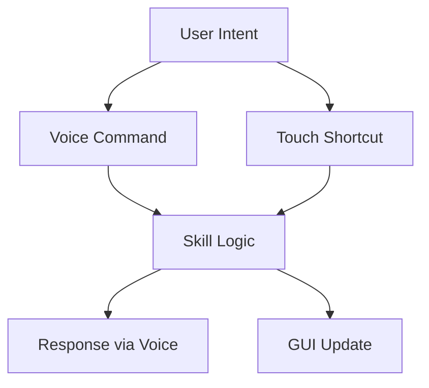
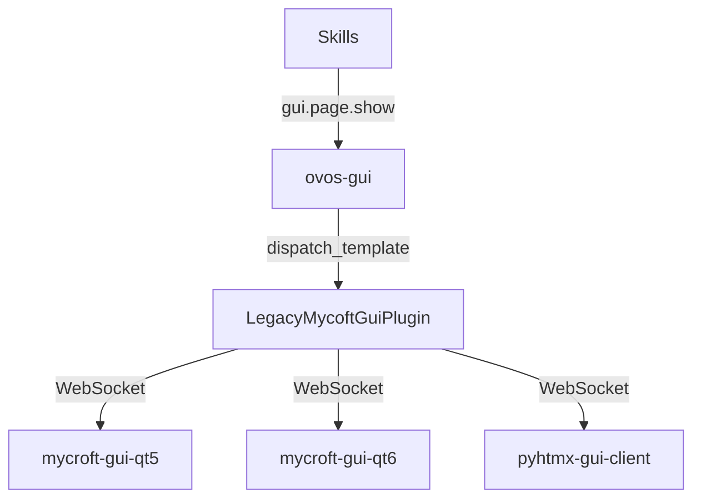

# OVOS GUI Design Philosophy

**Central source of truth for GUI architecture and template design**

This document establishes the foundational principles that guide all GUI development in OpenVoiceOS. It serves as the authoritative reference for:
- Template design decisions
- Voice-first interaction patterns
- Skill-display layer separation
- Cross-platform compatibility requirements

---

## Core Principles

### 1. Voice-First, Display-Second

**OVOS is fundamentally a voice assistant.** The GUI is a companion interface, not a replacement for voice interaction.

**Implications:**
- Every GUI interaction must have a voice equivalent
- Skills must never block waiting exclusively for GUI input
- Touch is a shortcut, never the only path
- Display-only devices must be fully supported



### 2. Template-Based Architecture

**Skills describe what, not how.** Skills use standardized templates to send structured data. Display adapters render independently.

**Benefits:**
- Skills don't need to know about UI frameworks (Qt, Web, etc.)
- Adapters don't need to know about skill logic
- Consistent UX across all skills
- Easy to add new display types

```mermaid
graph LR
    A[Skill] -- SYSTEM_weather\n{temp:22, condition:"cloudy"} --> B[ovos-gui]
    B -- render SYSTEM_weather --> C[Qt Adapter]
    B -- render SYSTEM_weather --> D[Web Adapter]
```

### 3. Separation of Concerns

**Clear boundaries between layers:**

| Layer | Responsibility | Ownership |
|-------|----------------|-----------|
| Skill | Provide semantic data | Skill developer |
| ovos-gui | Manage state, route messages | OVOS core |
| Adapter | Render templates | Display implementer |
| Client | Display pixels | Device manufacturer |

### 4. Template Justification Criteria

A template is added when:
1. **Semantic distinctness**: The data structure is meaningfully different from existing templates
2. **Cross-skill usage**: Needed by multiple unrelated skills (no single-skill templates)
3. **Essential functionality**: Core system needs (weather, clock, etc.)

A template is rejected when:
- It's a visual variation of an existing template (display layer's job)
- It can be composed from existing templates in sequence
- Its data model is a subset of a broader template
- It violates voice-first principles

---

## Template Design Guidelines

### Data Structure Principles

1. **Minimal viable data**: Only include what's semantically necessary
2. **Type safety**: Use enums for constrained values (e.g., FillMode)
3. **Optional where possible**: Make fields optional unless required for rendering
4. **Human-readable labels**: All text should be user-facing strings

### Naming Conventions

- **Template names**: `SYSTEM_<purpose>` (e.g., `SYSTEM_weather`)
- **Session keys**: lowercase_with_underscores (e.g., `current_temp`)
- **Enum values**: UPPER_CASE (e.g., `FillMode.FIT`)

### Versioning Strategy

- **Additive only**: New templates can be added
- **No breaking changes**: Existing templates must remain compatible
- **Deprecation path**: Mark old templates as deprecated before removal

---

## Voice-First Interaction Patterns

### Confirmation Pattern

```python
# Skill code
self.speak("Do you want to delete all alarms?")
gui.show_confirm("Do you want to delete all alarms?")

# Both paths fire the same event
gui.register_handler("confirm.response", self.handle_confirm)
```

**Key principle**: Voice and touch fire the same bus message. The skill handles both in one handler.

### Selection Pattern

```python
options = [
    SelectItem("Celsius", "celsius"),
    SelectItem("Fahrenheit", "fahrenheit")
]
self.speak("Which unit do you prefer? Celsius or Fahrenheit?")
gui.show_select(options, prompt="Choose a temperature unit")
```

**Key principle**: The spoken prompt and visual prompt are synchronized.

### Timer Pattern

```python
# Skill sets end time
gui.show_timer(end_time=time.time() + 600, label="Pasta")

# Display layer handles countdown
# No polling required from skill
```

**Key principle**: Display layer derives state from data (end_time + current_time).

---

## Template Categories

### System Group (ovos-gui managed)

| Template | Purpose | Session Data |
|----------|---------|---------------|
| `SYSTEM_idle` | Resting/homescreen | None |
| `SYSTEM_loading` | Indeterminate progress | `label: str` |
| `SYSTEM_status` | Success/failure | `label: str`, `success: bool` |
| `SYSTEM_error` | Error with detail | `label: str`, `detail: str?` |

**Design rationale**: These represent system states, not skill content.

### Content Group (read-only information)

| Template | Data Structure | Use Case |
|----------|----------------|----------|
| `SYSTEM_text` | Long-form text | Articles, instructions |
| `SYSTEM_image` | Image + metadata | Photos, icons |
| `SYSTEM_list` | Hierarchical items | Menus, search results |
| `SYSTEM_grid` | Image-primary tiles | Photo galleries |
| `SYSTEM_table` | Relational data | Structured information |

**Design rationale**: Each has semantically distinct data, not just visual differences.

### Media Group (time-based playback)

| Template | Key Fields | Separation Rationale |
|----------|------------|---------------------|
| `SYSTEM_audio_player` | Metadata card | No video stream |
| `SYSTEM_video_player` | Video surface | Raw media rendering |

**Design rationale**: Audio shows metadata while playing through sound system; video is a visual medium.

### Utility Group (single-purpose)

| Template | Self-Updating | Data Model |
|----------|---------------|------------|
| `SYSTEM_clock` | Yes | None needed |
| `SYSTEM_timer` | Yes | `end_time: float` |
| `SYSTEM_weather` | No | Structured weather data |
| `SYSTEM_map` | Partial | Latitude/longitude |

**Design rationale**: Clock and timer derive state from system time; weather and map need explicit data.

### Dialogue Group (voice-first)

| Template | Voice Equivalent | Touch Shortcut |
|----------|------------------|----------------|
| `SYSTEM_confirm` | `ask_yesno()` | `confirm.response` |
| `SYSTEM_select` | Spoken options | `select.response` |

**Design rationale**: Visual accompaniment only; voice is primary path.

### Avatar Group (embodied interaction)

| Template | State Management | Rendering |
|----------|-------------------|-----------|
| `SYSTEM_face` | Awake/sleeping | Adapter-specific |

**Design rationale**: Minimal data model; display layer owns visual representation.

---

## Cross-Platform Considerations

### Adapter Responsibilities

Each adapter must:
1. Implement all 25 templates
2. Handle missing data gracefully
3. Support all FillMode values
4. Maintain voice-first principles
5. Report capabilities to ovos-gui

### Capability Detection

```python
# Adapter registration
class MyAdapter(AbstractGUIPlugin):
    @property
    def supported_templates(self):
        return list(PageTemplates)  # All 25
    
    @property
    def capabilities(self):
        return {
            "touch_input": True,
            "voice_input": True,
            "animations": True
        }
```

### Fallback Behavior

When a capability is missing:
1. ovos-gui selects best available template
2. Adapter renders simplified version
3. No skill code changes required

---

## Performance Guidelines

### Skill Developers

- **Minimize updates**: Batch session data changes
- **Use persistence wisely**: Don't hold display longer than needed
- **Clean up**: Call `release()` when done
- **Avoid polling**: Use self-updating templates where possible

### Adapter Developers

- **Lazy rendering**: Only render visible templates
- **Memory management**: Release resources when namespace deactivates
- **Animation throttling**: Respect device performance constraints
- **Network efficiency**: Compress images, cache resources

---

## Security Considerations

### Data Validation

- **URL sanitization**: Validate all URLs before rendering
- **HTML escaping**: Sanitize HTML content
- **Image validation**: Verify image dimensions and formats
- **Session isolation**: Prevent namespace data leakage

### Permission Model

| Action | Permission Required |
|--------|---------------------|
| Show template | None (skills can always show) |
| Access other namespace | `gui.namespace.read` |
| Modify other namespace | `gui.namespace.write` |
| Show SYSTEM_idle | `gui.system.idle` (reserved) |

---

## Evolution Process

### Adding New Templates

1. **Proposal**: Create issue in ovos-gui with justification
2. **Review**: Architecture team evaluates against criteria
3. **Implementation**: Add to PageTemplates enum
4. **Documentation**: Update DESIGN_PHILOSOPHY.md and templates.md
5. **Adapter updates**: All adapters must implement

### Deprecating Templates

1. **Mark deprecated**: Add `@deprecated` decorator
2. **Document alternative**: Update DESIGN_PHILOSOPHY.md
3. **Grace period**: 12 months minimum
4. **Remove**: Only in major version bump

---

## Reference Implementation

### Minimal Skill Example

```python
from ovos_workshop.skills import OVOSSkill
from ovos_gui_api_client import GUIInterface

class ExampleSkill(OVOSSkill):
    def __init__(self):
        super().__init__()
        self.gui = GUIInterface(self.skill_id, bus=self.bus)
    
    def show_weather(self):
        self.gui.show_weather(
            current_temp=22,
            min_temp=18,
            max_temp=25,
            condition="Partly cloudy",
            location="Berlin"
        )
```

### Reference Adapter Implementation

**ovos-legacy-mycroft-gui-plugin** is the **canonical reference implementation** of the OVOS GUI adapter interface.

```python
from ovos_plugin_manager.templates.gui import AbstractGUIPlugin
from ovos_gui_api_client import PageTemplates

class LegacyMycoftGuiPlugin(AbstractGUIPlugin):
    """Reference implementation of AbstractGUIPlugin interface.
    
    This adapter:
    - Implements all 25 SYSTEM_* templates
    - Translates OVOS template API → Qt WebSocket protocol
    - Manages namespace stack and session data
    - Handles Qt client connections and synchronization
    """
    
    def handle_show_weather(self, skill_id, data):
        # Extract session data
        temp = data.get("current_temp")
        condition = data.get("condition")
        icon = data.get("icon")
        location = data.get("location")
        
        # Map to QML template
        qml_file = "Weather.qml"
        
        # Send to Qt clients via WebSocket
        self._show_qml_page(skill_id, qml_file, data)
        
        # Update session data
        self._sync_session_data(skill_id, data)
    
    def _show_qml_page(self, skill_id, qml_file, data):
        """Send mycroft.gui.list.insert message to Qt clients"""
        message = {
            "type": "mycroft.gui.list.insert",
            "namespace": skill_id,
            "position": 0,
            "data": [{"url": f"qrc:///qt5/{qml_file}", "page": qml_file}]
        }
        self._send_to_clients(message)
    
    def _sync_session_data(self, skill_id, data):
        """Send mycroft.session.set message to Qt clients"""
        message = {
            "type": "mycroft.session.set",
            "namespace": skill_id,
            "data": data
        }
        self._send_to_clients(message)
```

**Complete implementation**: [ovos-legacy-mycroft-gui-plugin](https://github.com/OpenVoiceOS/ovos-legacy-mycroft-gui-plugin)

### Key Features of Reference Implementation

1. **Complete Template Coverage**: All 25 SYSTEM_* templates implemented
2. **WebSocket Protocol**: Standard mycroft-gui protocol (port 18181)
3. **Namespace Management**: LIFO stack with homescreen support
4. **Session Synchronization**: Real-time data updates to clients
5. **Multi-Client Support**: Multiple Qt clients can connect simultaneously
6. **Error Handling**: Graceful degradation and validation

### Architecture Diagram



**Note**: The reference implementation uses the mycroft-gui WebSocket protocol, which is the current standard for all Qt-based GUI clients.

---

## Related Documents

| Document | Purpose |
|----------|---------|
| [ovos-gui: skill-development/templates.md](templates.md) | Complete template reference |
| [ovos-gui-api-client: page-templates.md](https://github.com/OpenVoiceOS/ovos-gui-api-client/blob/dev/docs/page-templates.md) | Skill API reference |
| [ovos-legacy-mycroft-gui-plugin: bus-api-reference.md](https://github.com/OpenVoiceOS/ovos-legacy-mycroft-gui-plugin/blob/dev/docs/bus-api-reference.md) | Bus message specifications |
| [ovos-legacy-mycroft-gui-plugin: ARCHITECTURE_REVIEW.md](https://github.com/OpenVoiceOS/ovos-legacy-mycroft-gui-plugin/blob/dev/docs/ARCHITECTURE_REVIEW.md) | Reference implementation architecture |
| [ovos-legacy-mycroft-gui-plugin: PROTOCOL_EXTENSIONS.md](https://github.com/OpenVoiceOS/ovos-legacy-mycroft-gui-plugin/blob/dev/docs/PROTOCOL_EXTENSIONS.md) | WebSocket protocol extensions |
| [ovos-legacy-mycroft-gui-plugin: OVOS_GUI_COMPATIBILITY.md](https://github.com/OpenVoiceOS/ovos-legacy-mycroft-gui-plugin/blob/dev/docs/OVOS_GUI_COMPATIBILITY.md) | Compatibility audit and verification |

---

## Change Log

| Version | Date | Changes |
|---------|------|---------|
| 1.0 | 2026-03-12 | Initial document establishing design philosophy |
| 1.1 | 2026-03-12 | Added cross-references to related documents |

---

**Maintainer**: OVOS Architecture Team
**Status**: Active
**Last Updated**: 2026-03-12
