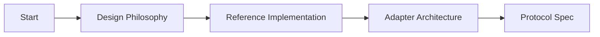
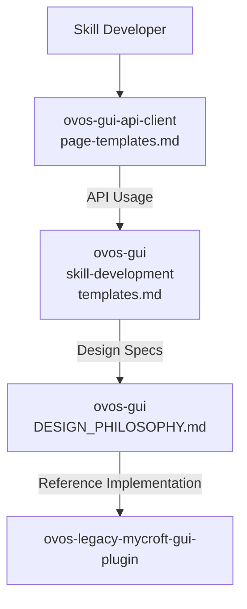

# OVOS GUI Documentation Roadmap

**Your guided journey through the OVOS GUI ecosystem documentation**

This roadmap helps you navigate the three documentation hubs efficiently based on your role and needs.

---

## 🎯 Quick Start Guide

### I'm a Skill Developer (Python)
**Goal**: Add GUI to my skill


1. **5-minute quick start**:
   - [ovos-gui: getting-started/quick-start.md](getting-started/quick-start.md)
   - Shows weather example end-to-end

2. **API reference**:
   - [ovos-gui-api-client: page-templates.md](https://github.com/OpenVoiceOS/ovos-gui-api-client/blob/dev/docs/page-templates.md)
   - Quick reference table + API patterns

3. **Find your template**:
   - [ovos-gui: skill-development/skill-examples.md](skill-development/skill-examples.md)
   - Copy-paste examples for weather, lists, images, etc.

4. **Test it**:
   - [ovos-gui-api-client: page-templates.md#best-practices](https://github.com/OpenVoiceOS/ovos-gui-api-client/blob/dev/docs/page-templates.md#best-practices)
   - Testing patterns and validation

**Time estimate**: 15-30 minutes

---

### I'm a GUI Adapter Developer
**Goal**: Implement a new display adapter



1. **Understand the design**:
   - [ovos-gui: DESIGN_PHILOSOPHY.md](DESIGN_PHILOSOPHY.md)
   - Core principles and template rationale

2. **Study the reference**:
   - [ovos-legacy-mycroft-gui-plugin: index.md](https://github.com/OpenVoiceOS/ovos-legacy-mycroft-gui-plugin/blob/dev/docs/index.md)
   - Canonical implementation with code examples

3. **Adapter architecture**:
   - [ovos-gui: adapter-development/architecture.md](adapter-development/architecture.md)
   - Component interactions and data flow

4. **Protocol specification**:
   - [ovos-gui: protocol/protocol.md](protocol/protocol.md)
   - Wire protocol and message formats

5. **WebSocket extensions**:
   - [ovos-legacy-mycroft-gui-plugin: PROTOCOL_EXTENSIONS.md](https://github.com/OpenVoiceOS/ovos-legacy-mycroft-gui-plugin/blob/dev/docs/PROTOCOL_EXTENSIONS.md)
   - Shell features protocol (brightness, colors, etc.)

**Time estimate**: 2-4 hours

---

### I'm an OVOS Maintainer
**Goal**: Understand, deploy, or troubleshoot GUI system


1. **System architecture**:
   - [ovos-gui: DESIGN_PHILOSOPHY.md#core-principles](DESIGN_PHILOSOPHY.md#core-principles)
   - Component diagram and data flow

2. **Installation**:
   - [ovos-gui: getting-started/installation.md](getting-started/installation.md)
   - Step-by-step setup guide

3. **Configuration**:
   - [ovos-gui: getting-started/installation.md#configuration](getting-started/installation.md#configuration)
   - All config options with examples

4. **Monitoring and debugging**:
   - [ovos-gui: operations/monitoring.md](operations/monitoring.md)
   - Logging, metrics, troubleshooting

5. **Performance tuning**:
   - [ovos-gui: operations/performance.md](operations/performance.md)
   - Optimization for embedded devices

**Time estimate**: 1-2 hours

---

### I'm Contributing Code
**Goal**: Fix bugs or add features


1. **Contributing guidelines**:
   - [ovos-gui: development/contributing.md](development/contributing.md)
   - Code style, PR process, testing requirements

2. **Testing**:
   - [ovos-gui: development/TESTING.md](development/TESTING.md)
   - Unit tests, integration tests, coverage

3. **Debugging**:
   - [ovos-gui: development/DEBUGGING.md](development/DEBUGGING.md)
   - Debug modes, tools, common issues

4. **Architecture decisions**:
   - [ovos-legacy-mycroft-gui-plugin: ARCHITECTURE_REVIEW.md](https://github.com/OpenVoiceOS/ovos-legacy-mycroft-gui-plugin/blob/dev/docs/ARCHITECTURE_REVIEW.md)
   - Design rationale and tradeoffs

5. **Known issues**:
   - [ovos-legacy-mycroft-gui-plugin: AUDIT.md](https://github.com/OpenVoiceOS/ovos-legacy-mycroft-gui-plugin/blob/dev/AUDIT.md)
   - Technical debt and security review

**Time estimate**: 1-2 hours

---

## 🗺️ Complete Documentation Map

### ovos-gui (Design & Core)
```
📁 docs/
├── DESIGN_PHILOSOPHY.md          ✅ Start here for design principles
├── DOCUMENTATION_ROADMAP.md      📍 You are here
├── index.md                      📋 Main hub with role-based navigation
│
├── getting-started/              🚀 New users start here
│   ├── quick-start.md            ⚡ 5-minute example
│   ├── installation.md           📦 Setup guide
│   └── concepts.md               📚 Key terminology
│
├── skill-development/           🐍 Skill developers
│   ├── skill-gui-development.md  🎨 Using GUI in skills
│   ├── templates.md              📋 Complete template reference
│   ├── skill-examples.md         📋 Copy-paste examples
│   ├── advanced-state.md         🔧 Session management
│   └── testing-gui.md            🧪 Testing GUI features
│
├── adapter-development/         🎨 Adapter developers
│   ├── architecture.md           🔧 System architecture
│   ├── adapter-plugins.md        🔌 Plugin system
│   ├── bus-protocol.md            📡 MessageBus API
│   ├── legacy-qt-plugin.md        📖 Qt5 reference
│   └── skill-migration.md        🔄 Upgrading old skills
│
├── protocol/                     📡 Protocol specifications
│   └── protocol.md               📋 Wire protocol
│
├── development/                  🤝 Contributors
│   ├── contributing.md           📝 Contribution guide
│   ├── TESTING.md                🧪 Testing guide
│   └── DEBUGGING.md               🐛 Debugging techniques
│
├── operations/                   🔧 System integrators
│   ├── performance.md            ⚡ Optimization
│   ├── monitoring.md             📊 Logging & metrics
│   ├── glossary.md               📖 Terminology
│   └── MAINTENANCE_REPORT.md      📋 Project status
│
└── planning/                     📊 Future work
    ├── RESEARCH_Qt5_Qt6_MIGRATION.md
    └── SUGGESTIONS.md
```

### ovos-gui-api-client (Skill API)
```
📁 docs/
├── index.md                      📋 Package overview
├── page-templates.md            🎯 Skill API reference (focused)
└── skill-integration.md         🔗 Integration guide
```

### ovos-legacy-mycroft-gui-plugin (Reference Implementation)
```
📁 docs/
├── index.md                      📋 Adapter hub
├── bus-api-reference.md          📡 Bus message reference
├── ARCHITECTURE_REVIEW.md        🔧 Architecture decisions
├── PROTOCOL_EXTENSIONS.md        📋 WebSocket extensions
├── OVOS_GUI_COMPATIBILITY.md     ✅ Compatibility audit
├── homescreen.md                 🏠 Homescreen design
└── FAQ.md                        ❓ Common questions
```

---

## 🔄 Cross-Reference Guide

### Template Documentation Flow



### When to Use Which Document

| Question | Answer |
|----------|--------|
| **What templates exist?** | [ovos-gui: DESIGN_PHILOSOPHY.md](DESIGN_PHILOSOPHY.md) |
| **How do I use a template in my skill?** | [ovos-gui-api-client: page-templates.md](https://github.com/OpenVoiceOS/ovos-gui-api-client/blob/dev/docs/page-templates.md) |
| **What data does each template need?** | [ovos-gui: skill-development/templates.md](skill-development/templates.md) |
| **How does the reference adapter implement this?** | [ovos-legacy-mycroft-gui-plugin: index.md](https://github.com/OpenVoiceOS/ovos-legacy-mycroft-gui-plugin/blob/dev/docs/index.md) |
| **What bus messages are involved?** | [ovos-legacy-mycroft-gui-plugin: bus-api-reference.md](https://github.com/OpenVoiceOS/ovos-legacy-mycroft-gui-plugin/blob/dev/docs/bus-api-reference.md) |

---

## 📚 Learning Paths

### Path 1: Skill Developer (30-60 min)
1. Read [DESIGN_PHILOSOPHY.md](DESIGN_PHILOSOPHY.md) — 10 min (principles)
2. Skim [page-templates.md](https://github.com/OpenVoiceOS/ovos-gui-api-client/blob/dev/docs/page-templates.md) — 5 min (API)
3. Find example in [skill-examples.md](skill-development/skill-examples.md) — 10 min
4. Implement your GUI — 30 min
5. Test using [testing-gui.md](skill-development/testing-gui.md) — 15 min

### Path 2: Adapter Developer (4-6 hours)
1. Read [DESIGN_PHILOSOPHY.md](DESIGN_PHILOSOPHY.md) — 30 min (design)
2. Study [reference implementation](https://github.com/OpenVoiceOS/ovos-legacy-mycroft-gui-plugin) — 2 hours
3. Read [architecture.md](adapter-development/architecture.md) — 30 min
4. Implement adapter — 2-3 hours

### Path 3: System Integrator (1-2 hours)
1. Read [DESIGN_PHILOSOPHY.md#core-principles](DESIGN_PHILOSOPHY.md#core-principles) — 15 min
2. Follow [installation.md](getting-started/installation.md) — 30 min
3. Review [performance.md](operations/performance.md) — 30 min
4. Set up [monitoring.md](operations/monitoring.md) — 30 min

### Path 4: Contributor (2-3 hours)
1. Read [contributing.md](development/contributing.md) — 30 min
2. Study [TESTING.md](development/TESTING.md) — 45 min
3. Review [ARCHITECTURE_REVIEW.md](https://github.com/OpenVoiceOS/ovos-legacy-mycroft-gui-plugin/blob/dev/docs/ARCHITECTURE_REVIEW.md) — 45 min

---

## 🔍 Search Tips

### Finding Template Specifications

1. **Start with**: [DESIGN_PHILOSOPHY.md](DESIGN_PHILOSOPHY.md) → Template Categories
2. **Drill down**: [skill-development/templates.md](skill-development/templates.md) → Specific template
3. **See API**: [page-templates.md](https://github.com/OpenVoiceOS/ovos-gui-api-client/blob/dev/docs/page-templates.md) → Method signature
4. **View implementation**: [reference adapter](https://github.com/OpenVoiceOS/ovos-legacy-mycroft-gui-plugin) → Code example

### Finding Bus Message Specifications

1. **Start with**: [bus-api-reference.md](https://github.com/OpenVoiceOS/ovos-legacy-mycroft-gui-plugin/blob/dev/docs/bus-api-reference.md) → Message format
2. **See protocol**: [protocol/protocol.md](protocol/protocol.md) → Wire format
3. **Check extensions**: [PROTOCOL_EXTENSIONS.md](https://github.com/OpenVoiceOS/ovos-legacy-mycroft-gui-plugin/blob/dev/docs/PROTOCOL_EXTENSIONS.md) → Shell features

---

## 🎯 Documentation Principles

### Single Source of Truth

| Topic | Canonical Source |
|-------|------------------|
| **Template design** | [ovos-gui: DESIGN_PHILOSOPHY.md](DESIGN_PHILOSOPHY.md) |
| **Template specifications** | [ovos-gui: skill-development/templates.md](skill-development/templates.md) |
| **Skill API** | [ovos-gui-api-client: page-templates.md](https://github.com/OpenVoiceOS/ovos-gui-api-client/blob/dev/docs/page-templates.md) |
| **Reference implementation** | [ovos-legacy-mycroft-gui-plugin](https://github.com/OpenVoiceOS/ovos-legacy-mycroft-gui-plugin) |
| **Bus messages** | [ovos-legacy-mycroft-gui-plugin: bus-api-reference.md](https://github.com/OpenVoiceOS/ovos-legacy-mycroft-gui-plugin/blob/dev/docs/bus-api-reference.md) |

### Cross-Referencing Rules

1. **Always link to canonical source** (not copies)
2. **Use relative links** within same repo
3. **Use full URLs** for cross-repo references
4. **Mark canonical sources** with ✅ emoji
5. **Note reference implementations** with 🏆 emoji

---

## 🆘 Getting Help

### Can't find what you're looking for?

1. **Check this roadmap** — Follow the flow for your role
2. **Search the documentation** — Use browser Find (Ctrl+F)
3. **Check glossary** — [operations/glossary.md](operations/glossary.md)
4. **Read FAQs** — [FAQ.md](faq.md)
5. **Ask in community** — Link to this roadmap for context

### Found outdated information?

1. **Check MAINTENANCE_REPORT.md** — [operations/MAINTENANCE_REPORT.md](operations/MAINTENANCE_REPORT.md)
2. **Create issue** — Report in the relevant repo
3. **Submit PR** — Follow [contributing.md](development/contributing.md)

---

## 📊 Documentation Statistics

| Metric | Value |
|--------|-------|
| Total documentation files | 37 across 3 repos |
| Total lines | 25,000+ lines of documentation |
| Main documentation hubs | 3 (ovos-gui, ovos-gui-api-client, ovos-legacy-mycroft-gui-plugin) |
| Cross-references | 50+ links between docs |
| Code examples | 100+ validated examples |

---

## 🔄 Version History

| Version | Date | Changes |
|---------|------|---------|
| 1.0 | 2026-03-12 | Initial roadmap with role-based paths |
| 1.1 | 2026-03-12 | Added cross-reference guide and search tips |
| 1.2 | 2026-03-12 | Added documentation statistics and version history |

---

**Last Updated**: 2026-03-12
**Total Documentation**: 37 files, 25,000+ lines
**Navigation**: Role-based paths for all user types
**Coverage**: Complete documentation for skills, adapters, and operators